<div align="center">
  
  
  <h3>✨ Experience Kerala Like Never Before ✨</h3>
  
  <p align="center">
    
    
    
    
    
    
  </p>

  <p align="center">
    <a href="#-features">Features</a> •
    <a href="#-demo">Demo</a> •
    <a href="#-quick-start">Quick Start</a> •
    <a href="#-tech-stack">Tech Stack</a> •
    <a href="#-project-structure">Structure</a> •
    <a href="#-contributing">Contributing</a>
  </p>

  
</div>

---

## 🎯 About

**Jude Tour Guide v2.2.0** is a modern, multilingual web application showcasing professional tour guide services in Kerala, India. Built with cutting-edge technologies, it features stunning glassmorphism design, smooth animations, comprehensive portfolio system, and support for 6 languages. 

### 🚀 What's New in v2.2.0
- Hidden Packages pages across all locales via middleware 404 with `X-Robots-Tag: noindex, nofollow` (reversible setup)
- Dynamic `sitemap.xml` excluding packages with full `hreflang` alternates for all languages
- Dynamic `robots.txt` disallowing `/packages` and localized variants; points to canonical sitemap URL
- Navigation and CTAs updated to route to Contact instead of Packages, avoiding dead links
- `SITE_CONFIG.url` set to `https://www.tourguidejude.com` for correct canonical generation in sitemap

### 🚀 What's New in v2.1.4
- Canonical URLs unified to `https://www.tourguidejude.com` and removed legacy manual `<link rel="canonical">` to resolve PSI canonical conflicts.
- Modernized `browserslist` production targets to reduce legacy JavaScript transforms and improve desktop performance scoring.
- LCP hero image now uses `fetchPriority="high"` for more consistent LCP.

### ⚡ Recently in v2.1.3
- Lazy-mounted heavy visuals using a new `LazyMount` utility to reduce initial JS and main-thread work.
- Deferred site-wide `AnimatedBackground` until browser idle; dynamically imported footer aquatics on viewport approach.
- Added `content-visibility: auto` and `contain-intrinsic-size` utilities for below-the-fold sections.
- Preconnected to cdnjs for Twemoji resources.

### 🎉 What's New in v2.1.0
- **🎬 Enhanced Page Animations**: Smooth page loading animations with staggered element entrance
- **🌈 Vibrant Color Palette**: Enhanced emerald-to-teal gradients and catchy color schemes throughout
- **📜 Scroll-Triggered Animations**: Content sections animate smoothly as users scroll down
- **🎯 Interactive Hover Effects**: Enhanced hover animations with scaling, rotation, and glow effects
- **✨ Premium Visual Experience**: Upgraded glassmorphism design with multi-layered gradient overlays
- **🎨 Enhanced Slideshow**: Improved image carousels with gradient borders and smooth transitions

### 🌟 Previous Major Updates (v2.0.0)
- **🖼️ Enhanced Image Galleries**: 42+ high-quality tour package images
- **🎠 Advanced Carousel System**: Auto-playing slideshows with controls
- **🌅 Redesigned Hero Section**: Immersive "Discover God's Own Country"
- **✨ Smooth Animations**: Page load and scroll-triggered animations
- **⚡ 30% Faster**: Optimized image loading and performance

<div align="center">
  
</div>

---

## ✨ Features

<table>
  <tr>
    <td align="center">🌍</td>
    <td><b>Multi-Language Support</b><br/>English, French, German, Spanish, Chinese, Japanese</td>
    <td align="center">🎨</td>
    <td><b>Modern UI/UX</b><br/>Glassmorphism design with smooth animations</td>
  </tr>
  <tr>
    <td align="center">📱</td>
    <td><b>Responsive Design</b><br/>Mobile-first approach for all devices</td>
    <td align="center">⚡</td>
    <td><b>Performance</b><br/>Optimized images, code splitting, lazy loading</td>
  </tr>
  <tr>
    <td align="center">🔍</td>
    <td><b>SEO Ready</b><br/>Meta tags, structured data, sitemap</td>
    <td align="center">♿</td>
    <td><b>Accessible</b><br/>ARIA labels, keyboard navigation, screen reader support</td>
  </tr>
  <tr>
    <td align="center">🎭</td>
    <td><b>Enhanced Portfolio</b><br/>Complete client showcase with filtering and case studies</td>
    <td align="center">🚀</td>
    <td><b>Production Ready</b><br/>856+ clients from 34 countries served</td>
  </tr>
</table>

---

## 🌐 Demo

<div align="center">
  
  
  ### 🔗 [Live Demo](https://jude-tour-guide.vercel.app) | 📸 [Screenshots](#screenshots)
</div>

---

## 🚀 Quick Start


### Prerequisites

- **Node.js** 18.17 or later
- **pnpm** (recommended) or npm/yarn

### Installation

```bash
# Clone the repository
git clone https://github.com/sharvinzlife/jude-tour-guide.git
cd jude-tour-guide

# Install dependencies (recommended)
pnpm install

# Start development server
pnpm dev

# Open http://localhost:3000
```

### Build & Deploy

```bash
# Build for production
pnpm build

# Start production server
pnpm start

# Deploy to Vercel (automatic)
vercel
```

---

## 🛠 Tech Stack

<div align="center">
  <table>
    <tr>
      <td align="center" width="120">
        
        <br><b>Next.js 15</b>
      </td>
      <td align="center" width="120">
        
        <br><b>TypeScript</b>
      </td>
      <td align="center" width="120">
        
        <br><b>Tailwind CSS</b>
      </td>
      <td align="center" width="120">
        
        <br><b>Framer Motion</b>
      </td>
    </tr>
    <tr>
      <td align="center" width="120">
        
        <br><b>Radix UI</b>
      </td>
      <td align="center" width="120">
        
        <br><b>shadcn/ui</b>
      </td>
      <td align="center" width="120">
        
        <br><b>next-intl</b>
      </td>
      <td align="center" width="120">
        
        <br><b>Vercel</b>
      </td>
    </tr>
  </table>
</div>

---

## 📁 Project Structure

<div align="center">
  
</div>



```mermaid
graph TD
    A[src/] --> B[app/]
    A --> C[components/]
    A --> D[lib/]
    A --> E[messages/]
    A --> F[styles/]
    A --> G[types/]
    
    B --> B1["[locale]/"]
    B1 --> B2[layout.tsx]
    B1 --> B3[page.tsx]
    B1 --> B4[about/]
    B1 --> B5[contact/]
    B1 --> B6[packages/]
    B1 --> B7[portfolio/]
    
    C --> C1[layout/]
    C --> C2[sections/]
    C --> C3[packages/]
    C --> C4[ui/]
    
    D --> D1[animations.ts]
    D --> D2[constants.ts]
    D --> D3[data/]
    D --> D4[utils.ts]
    
    E --> E1[en.json]
    E --> E2[fr.json]
    E --> E3[de.json]
    E --> E4[es.json]
    E --> E5[zh.json]
    E --> E6[ja.json]
    
    style A fill:#2ECC71
    style B fill:#3498DB
    style C fill:#E74C3C
    style D fill:#F39C12
    style E fill:#9B59B6
    style F fill:#1ABC9C
    style G fill:#34495E
```

### 📂 Directory Breakdown

```
🌴 jude-tour-guide/
├── 📱 src/
│   ├── 🎯 app/                    # Next.js App Router
│   │   ├── [locale]/              # Internationalized routes
│   │   │   ├── layout.tsx         # Locale layout
│   │   │   ├── page.tsx           # Home page
│   │   │   ├── about/             # About section
│   │   │   ├── contact/           # Contact form
│   │   │   ├── packages/          # Tour packages
│   │   │   └── portfolio/         # Gallery
│   │   ├── globals.css            # Global styles
│   │   └── layout.tsx             # Root layout
│   │
│   ├── 🧩 components/
│   │   ├── layout/                # Header, Footer, Nav
│   │   ├── sections/              # Page sections
│   │   ├── packages/              # Package cards
│   │   └── ui/                    # Reusable UI
│   │
│   ├── 🔧 lib/
│   │   ├── animations.ts          # Animation configs
│   │   ├── constants.ts           # App constants
│   │   ├── data/                  # Static data
│   │   └── utils.ts               # Helpers
│   │
│   ├── 🌍 messages/               # Translations
│   │   ├── en.json                # English
│   │   ├── fr.json                # French
│   │   ├── de.json                # German
│   │   ├── es.json                # Spanish
│   │   ├── zh.json                # Chinese
│   │   └── ja.json                # Japanese
│   │
│   ├── 🎨 styles/
│   │   └── glassmorphism.css     # Glass effects
│   │
│   └── 📝 types/
│       └── index.ts               # TypeScript types
│
├── 📦 public/                     # Static assets
├── 🔧 next.config.ts              # Next.js config
├── 🎨 tailwind.config.ts          # Tailwind config
├── 📝 tsconfig.json               # TypeScript config
└── 📄 package.json                # Dependencies
```

---

## 🌍 Supported Languages

<div align="center">
  <table>
    <tr>
      <td align="center">🇬🇧</td>
      <td>English</td>
      <td align="center">🇫🇷</td>
      <td>Français</td>
      <td align="center">🇩🇪</td>
      <td>Deutsch</td>
    </tr>
    <tr>
      <td align="center">🇪🇸</td>
      <td>Español</td>
      <td align="center">🇨🇳</td>
      <td>中文</td>
      <td align="center">🇯🇵</td>
      <td>日本語</td>
    </tr>
  </table>
</div>

---

## 📸 Screenshots

<div align="center">
  
  
  <i>Coming Soon...</i>
</div>

---

## 🎨 Features Showcase

### 🌊 Glassmorphism Design
```css
/* Beautiful glass effect throughout the UI */
.glass {
  background: rgba(255, 255, 255, 0.1);
  backdrop-filter: blur(10px);
  border: 1px solid rgba(255, 255, 255, 0.2);
}
```

### ⚡ Performance Optimized
- 🚀 **Lighthouse Score**: 95+
- 📦 **Bundle Size**: Optimized with code splitting
- 🖼️ **Image Optimization**: Next.js Image component with lazy loading
- ⏱️ **Load Time**: < 2s on 3G
- 🔍 **SEO Ready**: Complete meta tags, structured data, and sitemap
- 📱 **Mobile First**: Responsive design with touch optimization

### 🎭 Kerala-Themed Animations
Custom animations inspired by Kerala's culture:
- 🌊 Wave animations (backwaters)
- 🌴 Palm tree sway effects
- 🚣 Boat floating animations
- 🎨 Kathakali mask transitions

---

## 🛠️ Development

### 📝 Available Scripts

```bash
# Development
pnpm dev          # Start dev server
pnpm build        # Build for production
pnpm start        # Start production server
pnpm lint         # Run ESLint

# Dependencies
pnpm add [pkg]    # Add dependency
pnpm add -D [pkg] # Add dev dependency
pnpm remove [pkg] # Remove dependency
pnpm update       # Update dependencies
```

### 🔧 Configuration

#### Environment Variables
Create `.env.local`:
```env
NEXT_PUBLIC_SITE_URL=http://localhost:3000
# Add more variables as needed
```

#### VS Code Extensions
Recommended extensions for the best development experience:
- ESLint
- Prettier
- Tailwind CSS IntelliSense
- TypeScript Error Lens

## 🔒 Hidden Packages (Reversible) Setup

This project supports temporarily hiding the Packages pages and all their subpages without deleting code. The setup is fully reversible.

What’s enforced when hidden:
- Middleware at `src/middleware.ts` returns 404 with `X-Robots-Tag: noindex, nofollow` for `/packages` and `/[locale]/packages`.
- Dynamic `src/app/robots.ts` disallows crawling of packages paths.
- Dynamic `src/app/sitemap.ts` excludes packages from the sitemap but includes hreflang alternates for public pages.
- UI links to packages are removed from header/footer and CTAs to avoid dead links.

Restore Packages (re-enable):
1. Edit `src/middleware.ts`: remove or comment the regex block that returns 404 for packages.
2. Re-add UI links in:
   - `src/components/layout/Header.tsx`
   - `src/components/layout/Footer.tsx` and/or `FooterCompact.tsx`
   - CTAs in `HeroSectionSimple.tsx`, `ReadyToExploreSection.tsx`, `ServicesSection.tsx`, About page CTAs.
3. Update SEO:
   - `src/app/robots.ts`: remove `Disallow` entries for `/packages`.
   - `src/app/sitemap.ts`: include packages paths (e.g., add `'packages'` to the static paths or generate from data).
   - Optional: adjust `public/robots.txt` if relying on static robots.
4. Rebuild and deploy: `pnpm build && pnpm start`.
5. Submit `https://www.tourguidejude.com/sitemap.xml` to Google/Bing. Old packages URLs will reindex; use Search Console to expedite.

Hide again (turn-off): re-apply step 1, remove UI links, and ensure robots/sitemap exclude packages.

## 🚀 Deployment & Troubleshooting

### Vercel Deployment

This project is optimized for Vercel deployment with Next.js 15. If you encounter deployment issues:

#### Common Issues & Solutions

**Source-Map Module Error (500 Internal Server Error)**
```bash
Error: Cannot find module 'next/dist/compiled/source-map'
```

**Solution:**
1. Add source-map dependency:
```json
{
  "dependencies": {
    "source-map": "^0.7.6"
  },
  "devDependencies": {
    "source-map": "^0.7.6"
  }
}
```

2. Add webpack fallback in `next.config.ts`:
```typescript
webpack: (config: any) => {
  config.resolve.fallback = {
    ...config.resolve.fallback,
    'source-map': require.resolve('source-map'),
  }
  return config
}
```

**Async Params Issues with Next.js 15**
- Use `useEffect` and state instead of `React.use()` for async params
- Add proper loading states and optional chaining for safety
- Ensure all hooks are called at component top level

### Performance Optimization
- Images are optimized with Next.js Image component
- Static generation for better SEO and performance
- Framer Motion animations are optimized for 60fps
- Tailwind CSS purging reduces bundle size

---

## 🤝 Contributing

<div align="center">
  
</div>

We welcome contributions! Please see our [Contributing Guide](CONTRIBUTING.md) for details.

1. Fork the repository
2. Create your feature branch (`git checkout -b feature/AmazingFeature`)
3. Commit your changes (`git commit -m 'Add some AmazingFeature'`)
4. Push to the branch (`git push origin feature/AmazingFeature`)
5. Open a Pull Request

---

## 📄 License

This project is licensed under the MIT License - see the [LICENSE](LICENSE) file for details.

---

## 👨‍💻 Author

<div align="center">
  
  
  **Sharvin**
  
  [](https://github.com/sharvinzlife)
  [](#)
  [](#)
</div>

---

## 🙏 Acknowledgments

- [Next.js](https://nextjs.org/) - The React Framework
- [Vercel](https://vercel.com/) - Deployment Platform
- [shadcn/ui](https://ui.shadcn.com/) - UI Components
- [Radix UI](https://www.radix-ui.com/) - Primitives
- [Tailwind CSS](https://tailwindcss.com/) - Utility-first CSS
- [Framer Motion](https://www.framer.com/motion/) - Animation Library

---

<div align="center">
  
  
  ### ⭐ Star this repo if you find it helpful!
  
  
</div>